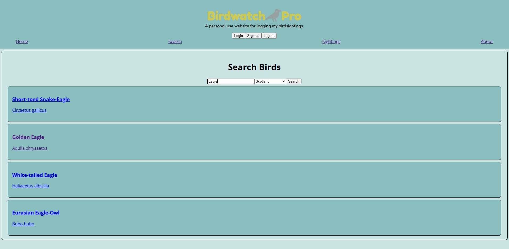

# Birdwatch Pro

This is a personal project designed to be a birdwatch list where you'd be able to store a list of your sightings.  Currently the only searchtype is by the name of the bird.
This is partly due to the limitations of the API I used, which will be listed below.

Any feedback would be greatly appreciated.  As this is my final major project as part of my Full Stack Web Development course, I am still not 100% on all the code written.

# Technologies used:

React
Express
PostgreSQL
JWT Authentication
eBird API[found here](https://documenter.getpostman.com/view/664302/S1ENwy59)
iNaturalist API[found here](https://www.inaturalist.org/pages/api%2Breference)

# Instructions to setup:

## Install frontend

npm install
npm run dev

## Install backend

cd server
npm install
npm start

# Screenshots of site

## Homepage

This is the example of the homepage.

[Homepage](Home.png)

## Search

This is how the search page is currently displayed.  As noted on the home page, it requires additional refinement, however this would mean utilising a different API which can handle searches based on size, colour etc.

## Search Results

This is how the search results are displayed, with an option to add them to your sightings list.

[Search results](SearchResult.png)

## Saved Sightings

This is where saved sightings are stored.  These are stored per user, and saved across login/logouts.

[Sightings](Sightings.png)

## Login

[Login page](ValidLogin.png)

This is an example of entering valid information into the login.

## Example of invalid login details

This is an example of what is returned upon entering invalid information into the login.

[Invalid Login results](InvalidLogin.png)

# A breakdown of the technologies and frontend/backend:

Frontend:
React + React Router

Backend:
Express API with protected JWT routes

Database:
PostgreSQL relational schema

Authentication:
bcrypt password hashing + JWT tokens

External APIs:
eBird taxonomy/search
iNaturalist images
